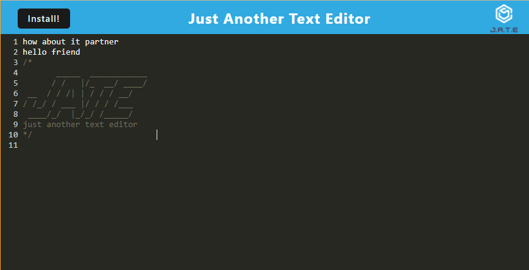

# Just Another Text Editor
## Badge 

## Description 
This is a Progressive Web Application aka PWA. It is a single page text editor that you can use to store and write text. It is functionable offline and can also be installed to the user's local machine. Here is a link to the deployed application [click here:](https://polar-sands-20731.herokuapp.com/)

## Table of Contents (Optional)
- [Demo](#demo)
- [License](#license)
- [Technologies](#technologies)
- [Usage](#usage)
- [E-mail](#e-mail)

## Demo

## License
MIT License
Permission is hereby granted, free of charge, to any person obtaining a copy of this software and associated documentation files the Software, to deal in the Software without restriction, including without limitation the rights to use, copy, modify, merge, publish, distribute, sublicense, and/or sell copies of the Software, and to permit persons to whom the Software is furnished to do so, subject to the following conditions. Click on Badge for more info.

## Technologies
- Babel
- CSS-Loader
- Style-Loader
- Webpack
- Workbox
- Idb
- Express

## Usage
The user can visit link provided in the description and then hit install to install it to there local machine. Then just start writing your texts. 

Or you can clone this repository then use `NPM I` to install all necessary dependancies. Then use `NPM Start` to build and launch the application locally. 

## Credits
Hunter Coleman aka. Skruphold.

## Questions
### Username
<a href="https://github.com/Skruphold">Skruphold</a>
### E-mail
<a href="mailto: Hunterco999@gmail.com">Hunterco999@gmail.com</a>